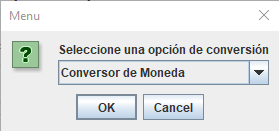
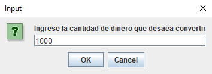
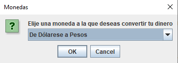
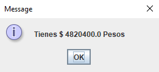
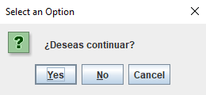

# Challenge-Oracle-Currency-Converter

This is a converter made with Java programming language. Developed on Eclipse IDE.
To run this project, you need to have Java installed on your computer.

### How to run
- Download, clone or fork the project
- Open the project on your favorite IDE (Eclipse, Netbeans, etc), personally I use Eclipse
- Run the project

### Convertor Features
- Currency convertor
- Temperature convertor

### Use
- Choose the option you want to use.
- Enter the value you want to convert.

- Enter the currency you want to convert

- Boala! You have your converted value.

- If you want to convert another value, press on **Yes** botton.

- If you want to exit, press on **No** botton.

- If you enter a wrong value or a value that is not a number, the program will ask you to enter a valid value, and go back to the menu.

### Tools and Technologies used

### Author
bcondict - [GitHub](https://github.com/bcondict) - [LinkedIn](https://www.linkedin.com/in/dev-jesus-junco/)
